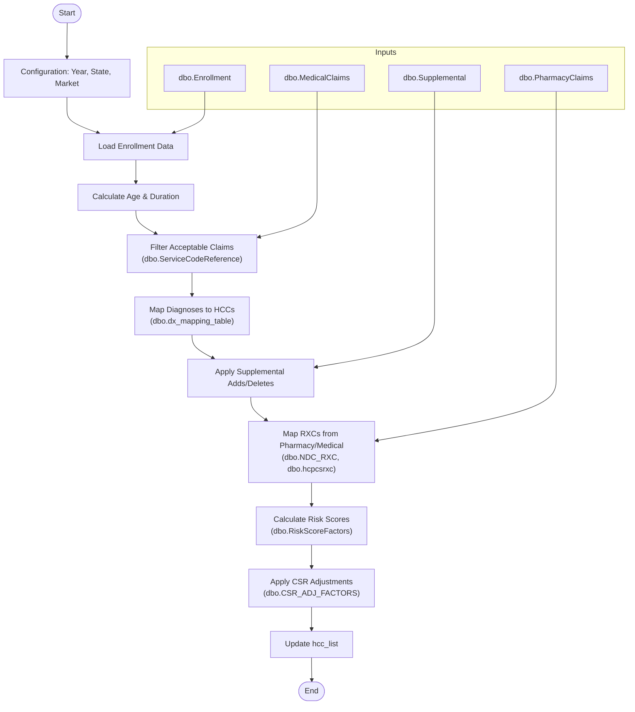
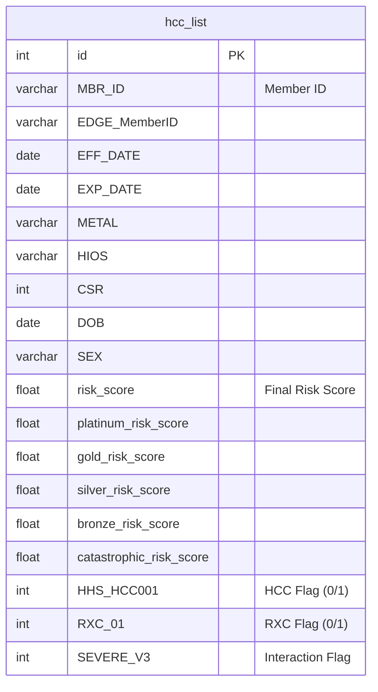
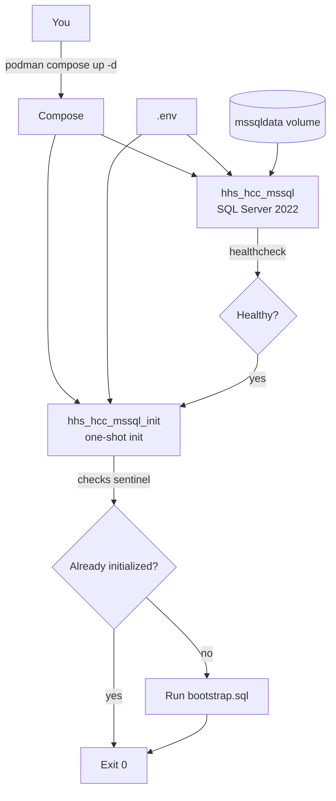
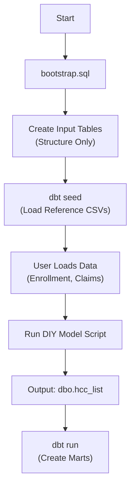
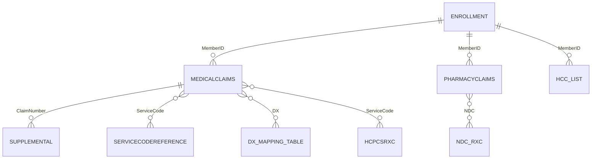

# HHS HCC SQL Risk Score Model

Documentation: https://garthmortensen.github.io/HHS_HCC_SQL_container

## Why Implement This?

This project modernizes the traditional HHS-HCC calculation by wrapping the standard logic in a **software engineering workflow**. Unlike static SAS scripts or ad-hoc SQL procedures, this approach delivers:

*   **Reproducibility & Version Control**: Git-backed code means every change to logic or coefficients is tracked, reviewable, and reversible. No more "v2_final_final.sql". And if something breaks, you can always roll back to a known good state.
*   **Analytical Rigor**: The dbt framework adds testing, lineage, and documentation to your data pipeline, ensuring data quality before it hits the model.
*   **Advanced Decomposition**: The architecture is designed for "What-If" analysis, allowing you to cleanly separate regulatory model impacts from population health shifts.
*   **Portable Infrastructure**: The containerized SQL Server setup ensures that your model runs identically on a laptop, a server, or in the cloud, eliminating "it works on my machine" issues.
*  **Extensibility**: Modular code structure makes it easy to adapt to future HHS model changes or incorporate custom business logic.

## Quick Start

### 1. Infrastructure (Container)

1.  **Clone & Configure**
    ```bash
    git clone https://github.com/garthmortensen/HHS_HCC_SQL_container.git
    cd HHS_HCC_SQL_container
    # Edit .env and set MSSQL_SA_PASSWORD
    ```

2.  **Start SQL Server**
    ```bash
    podman compose -f containers/mssql/docker-compose.yml up -d
    ```
    *Wait for `Init complete` in logs (`podman logs -f hhs_hcc_mssql_init`).*

3.  **Stop & Reset** (Destroys Data)
    ```bash
    podman compose -f containers/mssql/docker-compose.yml down -v
    ```

### 2. Project Initialization (dbt)

This project uses dbt to load reference data (seeds) and build analytic models.

1.  **Install & Configure dbt**
    ```bash
    python -m pip install -r transform/requirements.txt
    mkdir -p ~/.dbt && cp transform/profiles/profiles.yml ~/.dbt/profiles.yml
    ```

2.  **Load Reference Data**
    ```bash
    cd transform
    dbt deps
    dbt seed
    ```

### 3. Managing the Container

-   **Connect** (DBeaver/SSMS): `localhost:1433`, User: `sa`, Password: `<MSSQL_SA_PASSWORD>`, DB: `edge`
-   **Reset** (Destroys Data): `podman compose -f containers/mssql/docker-compose.yml down -v` then `up -d`

## Data Preparation

The container creates the empty structure for the 4 input tables. Reference tables (Factors, Mappings) are loaded via `dbt seed`.

You must populate the following tables with your own data.

1. dbo.Enrollment
1. dbo.MedicalClaims
1. dbo.PharmacyClaims
1. dbo.Supplemental

**Note**: All input tables have a `RowNo` primary key column; do not insert into this column as it is auto-incremented.

### Enrollment
You must populate all fields in this table other than the EPAI field, paid through date field, EDGE_MemberID field, user defined fields, and the ZIP, Race, Ethnicity, Subsidy, and ICHRA/QSEHRA indicators.
- **Split Spans**: If an enrollment span crosses plan years, you must split it into two separate plan years.
- **HIOS ID**: Populate the full 16-digit HIOS ID (including CSR Variant). If unknown, use a dummy value ending in 00.
- **Metal Levels**: Use Bronze, Silver, Gold, Platinum, or Catastrophic.
- **Market**: Use 1 for individual and 2 for small group.

### Medical Claims
- Populate all lines of all approved claims, and fill the dollar amounts at the line level.
- **Required Fields**: All fields other than DX2-DX25, billtype, modifiers, revenue code, service code, and place of service are required.
- **Form Type**: "P" for professional, "I" for institutional.
- **Diagnosis Codes**: Exclude any “.”s found in the ICD-10 diagnosis codes.
- **Versioning**: Populate only the latest version of a claim (full replacement model).
- **Denied Claims**: The "DeniedFlag" column is ignored; exclude denied claims before loading.

### Supplemental
- Populate any supplemental diagnosis codes by linking it to a claim.
- **Add/Delete**: Use “A” for Add and “D” for delete in the `AddDeleteFlag` column.
- **Formatting**: Exclude any “.”s found in the ICD-10 diagnosis codes.

### Pharmacy Claims
- **Required**: MemberID, claimnumber, NDC, filleddate, paiddate, billedamount, allowedamount, and paidamount.

## DIY Model Script Logic

The `DIY-Model-Script/diy_model_script.sql` is the core calculation engine. It processes the input data to generate risk scores.



### Step-by-Step Process
1.  **Enrollment Staging**: Populates the base `hcc_list` from the `Enrollment` table and calculates member age and enrollment duration.
2.  **Claims Filtering**: Identifies acceptable medical claims based on Bill Types and Service Codes.
3.  **Diagnosis Mapping**: Maps ICD-10 codes to Hierarchical Condition Categories (HCCs) using the `dx_mapping_table`, applying age/sex edits and `Supplemental` diagnosis adds/deletes.
4.  **RXC Mapping**: Maps National Drug Codes (NDCs) and HCPCS codes to Prescription Drug Categories (RXCs).
5.  **Risk Scoring**: Calculates the final risk score by summing coefficients for:
    *   Demographic factors (Age/Sex)
    *   HCCs
    *   RXCs
    *   Interaction terms (Severe illness, Transplant, etc.)
6.  **CSR Adjustment**: Applies Cost-Sharing Reduction factors to the raw scores.

## Output Data Model

The script outputs to `dbo.hcc_list`. This table contains one row per member per enrollment span (aggregated) with their calculated risk scores and flags for every triggered HCC and RXC.



## Running the Model

1.  **Populate Tables**: Ensure the 4 input tables are populated.
2.  **Configure Script**: Open `DIY-Model-Script/DIY Model Script.sql`.
    -   Update the `USE` statement (line 4) with your database name.
    -   Set the benefit year.
    -   Update start date, end date, and paid through dates.
3.  **Execute**: Run the script. It should take a few minutes.

### Running via `config.yml` (Python)

This repo includes a small runner that reads `config.yml` (including the `database:` section) and executes `DIY-Model-Script/diy_model_script.sql` with those settings.

```bash
# From repo root
python scripts/run_parametrized_diy_model.py
```
4.  **Build Marts**: Run dbt to generate the final analytic tables.
    ```bash
    dbt run
    ```
5.  **Results**:
    -   `dbo.hcc_list`: Raw output from DIY script.
    -   `mart.fct_hcc_list`: Cleaned fact table.
    -   `mart.agg_member_risk_score`: Aggregated risk scores.

## Advanced Usage: Waterfall Impact Analysis

This project allows you to perform a **"Waterfall" Impact Analysis** by decoupling the *Data Window* from the *Model Year*. This decomposes year-over-year score changes into specific drivers, helping you explain *why* scores moved—was it the government's model changes, or your population's health?

### The Decomposition Steps

1.  **Baseline (Year T-1)**
    *   **Data**: Year T-1 Claims/Enrollment
    *   **Model**: Year T-1
    *   **Result**: Your actual starting risk score.

2.  **Step 1: Regulatory Model Impact**
    *   **Data**: **Year T-1** Claims/Enrollment
    *   **Model**: **Year T**
    *   **Analysis**: Compare to Baseline. The difference is purely due to HHS coefficient updates, logic changes (e.g., interaction terms), and ICD-to-HCC mapping updates.

3.  **Step 2: Population & Coding Shift**
    *   **Data**: **Year T** Claims/Enrollment
    *   **Model**: **Year T**
    *   **Analysis**: Compare to Step 1. The difference is driven by:
        *   **Demographics**: Aging, new entrants, disenrollment.
        *   **Plan Mix**: Changes in Metal Levels/CSR affecting induced demand.
        *   **Acuity/Coding**: Changes in disease prevalence and coding capture.

4.  **Final (Year T)**
    *   **Result**: Your actual ending risk score.

*Example Narrative: "Our score dropped 2%. The new HHS model caused a 5% drop (Step 1), but our population got 3% sicker (Step 2), netting to -2%."*

### Increasing Granularity

You can further decompose "Population & Coding Shift" (Step 2) by isolating specific variables:

*   **Member Churn**: Separate the impact of members leaving vs. new entrants (Selection Effect).
*   **Demographic Drift**: Isolate the effect of the population simply aging one year vs. changes in Metal Level mix.
*   **Clinical Progression**: Distinguish between existing members getting sicker (e.g., Diabetes w/o Complication -> Diabetes w/ Complication) vs. new diagnoses.
*   **Coding Completeness**: Compare scores at different claim runout periods (3 vs. 6 vs. 9 months) to measure operational lag.
*   **Provider Attribution**: Decompose score changes by provider group to identify coding initiatives or care pattern shifts.
*   **Rx vs. Medical**: Analyze the shift in risk capture between Pharmacy (RXC) and Medical (HCC) claims.

## Decomposition goal, orchestration

To perform the decomposition, you need to run the DIY model 4 times with different combinations of population data and model coefficients. Given the minimal decomp requires many runs, a job orchestration tool (dagster or custom implementation?) would save labor and reduce errors.

Run these 4 jobs:

1. S(P0, C0) baseline (old pop, old coeff)
1. S(P0, C1) coeff-only change 
1. S(P1, C0) population-only change
1. S(P1, C1) actual new (new pop, new coeff)

Then decompose:

1. Population effect (holding coefficients fixed): S(P1,C0) - S(P0,C0)
1. Coefficient effect (holding population fixed): S(P0,C1) - S(P0,C0)
1. Interaction (optional): S(P1,C1) - S(P1,C0) - (S(P0,C1) - S(P0,C0))
1. No interaction with symmetric average of the two orderings:
    1. Pop effect = 0.5 * [(S(P1,C0)-S(P0,C0)) + (S(P1,C1)-S(P0,C1))]
    1. Coeff effect = 0.5 * [(S(P0,C1)-S(P0,C0)) + (S(P1,C1)-S(P1,C0))]

## Documentation

To generate the dbt documentation site:

```bash
cd transform
dbt docs generate
python make_static_docs.py
```

## Diagrams

### Containerization Flow



### SQL Loading Flow



### ERD (Conceptual Joins)



## Known Limitations & TODO

### Limitations
1.  Does not account for billable vs. non-billable member months in PLRS calculation.
2.  Only applies basic selection logic; does not apply full EDGE server exclusion logic (e.g., duplication).

## Source & License

This repo is a fork of the [original work by **Wesley Evenson**](https://github.com/Evensun-Health/HHS_HCC_SQL). Original documentation and support can be found at the sourced repo. Note that this is a derivative work and is not affiliated with Wesley Evenson, but carries forward the original GNU General Public License.

This package was developed based on the CMS/HHS Published DIY SAS model for the HHS-HCC risk adjustment program, published at https://www.cms.gov/cciio/resources/regulations-and-guidance#Health%20Market%20Reforms. The current version was based on the DIY model published January 7, 2025, relying on the “instructions” [^1] and “technical details” [^2]. We have made our best efforts to replicate the logic found in the CMS-published SAS algorithm in T-SQL assuming a Microsoft SQL Server environment. For benefit years where HHS has not yet issued a DIY model , the most recently published coefficients found in rulemaking were used.