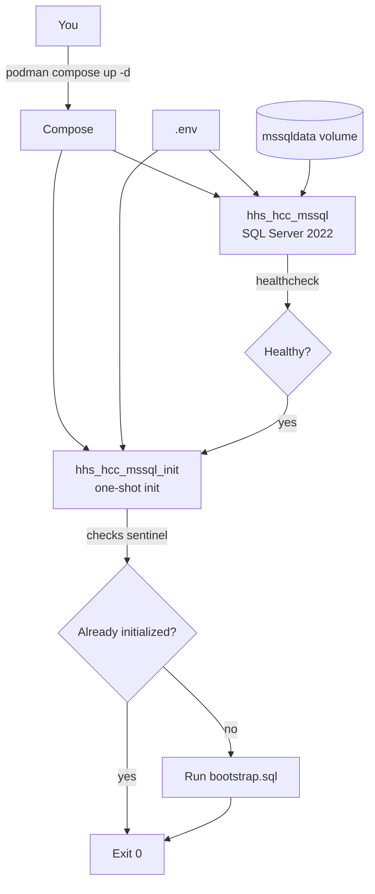
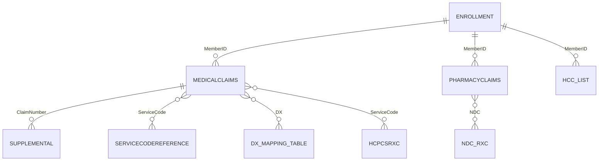

# HHS HCC SQL Risk Score Model

Documentation: https://garthmortensen.github.io/HHS_HCC_SQL_container

This package was developed based on the CMS/HHS Published DIY SAS model for the HHS-HCC risk adjustment program, published at https://www.cms.gov/cciio/resources/regulations-and-guidance#Health%20Market%20Reforms. The current version was based on the DIY model published January 7, 2025, relying on the “instructions” [^1] and “technical details” [^2]. We have made our best efforts to replicate the logic found in the CMS-published SAS algorithm in T-SQL assuming a Microsoft SQL Server environment. For benefit years where HHS has not yet issued a DIY model , the most recently published coefficients found in rulemaking were used.

## Disclaimer

Although this model has been tested and found to be consistent with the HHS SAS model and with EDGE server business rules and logic, it is offered AS IS with no warranty, express, implied or otherwise. The user assumes any and all risks associated with using this model, including potential risks to your data; it is HIGHLY recommended that you use a database dedicated to deploying this model, as the table creation scripts drops and recreates tables throughout. If you happen to have had a table named in the same way as this model named it, you could experience data loss.

## Quick Start (Containerized)

This repo includes a Podman-friendly SQL Server 2022 setup at `containers/mssql/docker-compose.yml`. It creates a database (default: `edge`, configurable via `MSSQL_DB`) and runs the table/reference scripts automatically on first start via `containers/mssql/init/bootstrap.sql`.

### 1. Setup

1.  **Clone this repo**
    ```bash
    git clone https://github.com/garthmortensen/HHS_HCC_SQL_container.git
    cd HHS_HCC_SQL_container
    ```

2.  **Create your local `.env`**
    Edit `.env` in the repo root and set a strong password:
    - `MSSQL_SA_PASSWORD` (required; must meet SQL Server complexity rules)

3.  **Start SQL Server (detached) + one-time init**
    ```bash
    podman compose -f containers/mssql/docker-compose.yml up -d
    ```

4.  **Watch init logs**
    ```bash
    podman compose -f containers/mssql/docker-compose.yml logs -f mssql-init
    ```
    The init service is health-gated. When it prints `Init complete`, the DB is ready.

5.  **Verify Connection**
    ```bash
    podman exec hhs_hcc_mssql /bin/bash -lc '/opt/mssql-tools18/bin/sqlcmd -S 127.0.0.1,1433 -U sa -P "$MSSQL_SA_PASSWORD" -C -b -Q "SELECT 1"'
    ```

### 2. Managing the Container

-   **Connect** (DBeaver/SSMS/Azure Data Studio):
    -   Host: `localhost`, Port: `1433`
    -   User: `sa`, Password: `<MSSQL_SA_PASSWORD>`
    -   Database: `<MSSQL_DB>`

-   **Stop/Start** (keeps data):
    ```bash
    podman compose -f containers/mssql/docker-compose.yml down
    podman compose -f containers/mssql/docker-compose.yml up -d
    ```

-   **Reset** (DESTROYS DATA):
    ```bash
    podman compose -f containers/mssql/docker-compose.yml down -v --remove-orphans
    podman compose -f containers/mssql/docker-compose.yml up -d
    ```

## Data Preparation

Once the table load scripts have been run (automatically by the container), you will need to populate 4 of the tables with your own enrollment, claims, and supplemental diagnosis data.

**Note**: All input tables have a `RowNo` primary key column; do not insert into this column as it is auto-incremented.

### Enrollment
You must populate all fields in this table other than the EPAI field, paid through date field, EDGE_MemberID field, user defined fields, and the ZIP, Race, Ethnicity, Subsidy, and ICHRA/QSEHRA indicators.
- **Split Spans**: If an enrollment span crosses plan years, you must split it into two separate plan years.
- **HIOS ID**: Populate the full 16-digit HIOS ID (including CSR Variant). If unknown, use a dummy value ending in 00.
- **Metal Levels**: Use Bronze, Silver, Gold, Platinum, or Catastrophic.
- **Market**: Use 1 for individual and 2 for small group.

### Medical Claims
- Populate all lines of all approved claims, and fill the dollar amounts at the line level.
- **Required Fields**: All fields other than DX2-DX25, billtype, modifiers, revenue code, service code, and place of service are required.
- **Form Type**: "P" for professional, "I" for institutional.
- **Diagnosis Codes**: Exclude any “.”s found in the ICD-10 diagnosis codes.
- **Versioning**: Populate only the latest version of a claim (full replacement model).
- **Denied Claims**: The "DeniedFlag" column is ignored; exclude denied claims before loading.

### Supplemental
- Populate any supplemental diagnosis codes by linking it to a claim.
- **Add/Delete**: Use “A” for Add and “D” for delete in the `AddDeleteFlag` column.
- **Formatting**: Exclude any “.”s found in the ICD-10 diagnosis codes.

### Pharmacy Claims
- **Required**: MemberID, claimnumber, NDC, filleddate, paiddate, billedamount, allowedamount, and paidamount.

## Running the Model

1.  **Populate Tables**: Ensure the 4 input tables above are populated.
2.  **Configure Script**: Open `DIY-Model-Script/DIY Model Script.sql`.
    -   Update the `USE` statement (line 4) with your database name.
    -   Set the benefit year.
    -   Update start date, end date, and paid through dates.
3.  **Execute**: Run the script. It should take a few minutes.
4.  **Results**: Output is written to `hcc_list` (risk scores by member/span) and a summary by HIOS ID is displayed.

## dbt Transforms + Docs

This repo includes a dbt project at `transform/` that targets the same SQL Server database.

### Setup

1.  **Install dbt** (requires Python 3.11 or 3.12):
    ```bash
    python -m pip install -r transform/requirements.txt
    ```

2.  **Configure Profile**:
    ```bash
    mkdir -p ~/.dbt
    cp transform/profiles/profiles.yml ~/.dbt/profiles.yml
    ```

3.  **Run dbt**:
    ```bash
    cd transform
    dbt deps
    dbt build
    dbt docs generate
    python make_static_docs.py
    ```

## Diagrams

### Containerization Flow



### SQL Loading Flow

```mermaid
flowchart TD
  A[Start] --> B[bootstrap.sql]
  B --> C[Load Input Tables<br/>(DROP/CREATE)]
  C --> D[Load Reference Tables<br/>(DX Mapping, Factors, etc.)]
  D --> E[User Loads Data<br/>Enrollment, Claims, etc.]
  E --> F[Run DIY Model Script]
  F --> G[Output: dbo.hcc_list]
```

### ERD (Conceptual Joins)



## Known Limitations & TODO

### Limitations
1.  Does not account for billable vs. non-billable member months in PLRS calculation.
2.  Only applies basic selection logic; does not apply full EDGE server exclusion logic (e.g., duplication).

## Support

This repo is a fork of the original work by Wesley Evenson.
