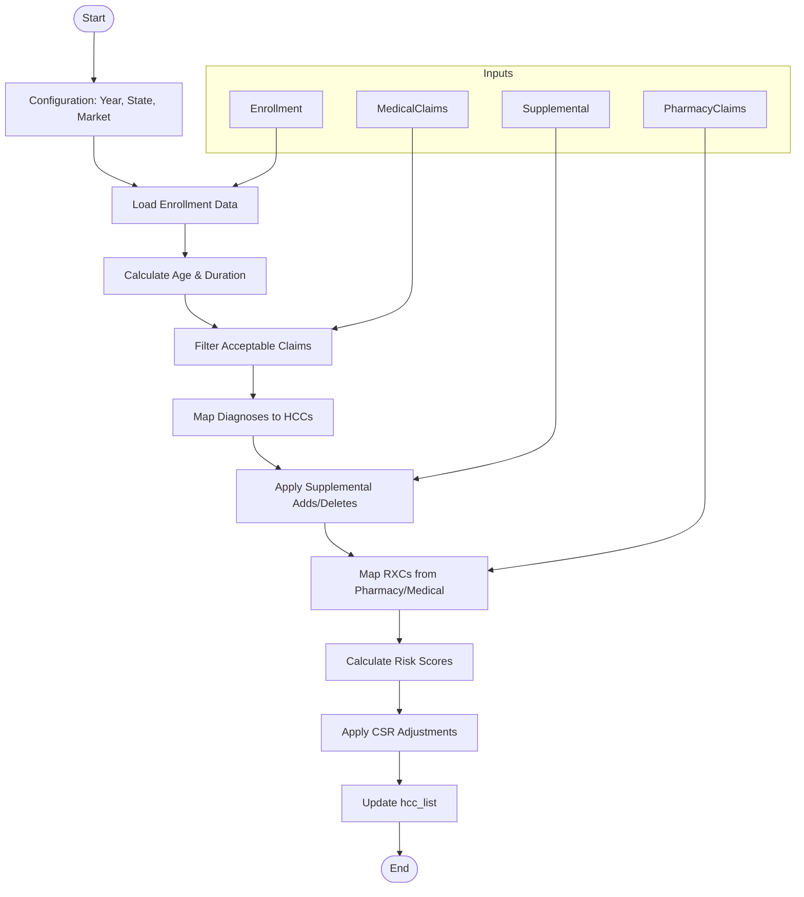
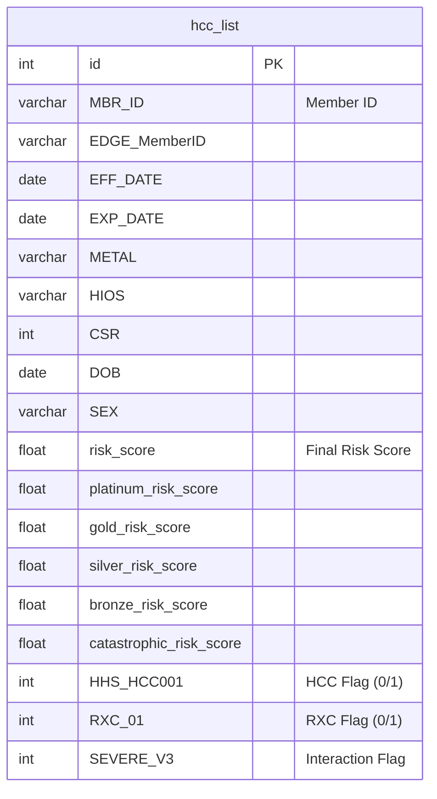
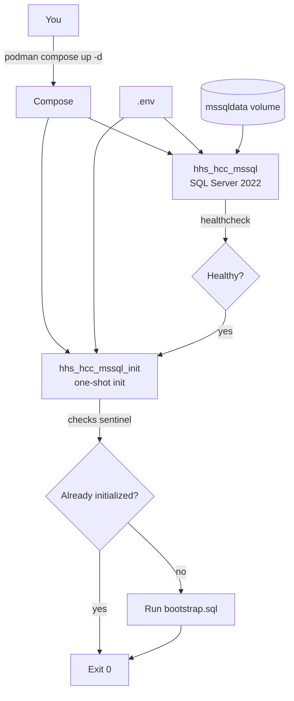
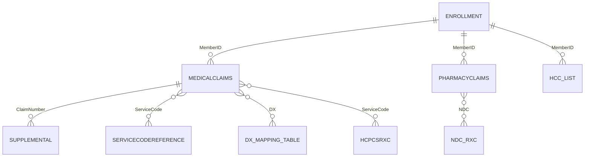

# HHS HCC SQL Risk Score Model

Documentation: https://garthmortensen.github.io/HHS_HCC_SQL_container

## Why Implement This?

For new Risk Adjustment teams, this project offers a **transparent, zero-cost alternative** to expensive vendor "black box" solutions. By running the HHS-HCC model directly in your own SQL environment, you gain:

*   **Full Visibility**: Audit every step of the calculation, from claim filtering to coefficient application.
*   **Data Control**: Keep your sensitive member data within your own infrastructure.
*   **Rapid Iteration**: Test scenarios and forecast scores instantly without waiting for vendor turnaround.
*   **Foundation for Growth**: Built on standard SQL and dbt, it scales easily from a single analyst to a full data engineering team.

## Quick Start

### 1. Infrastructure (Container)

1.  **Clone & Configure**
    ```bash
    git clone https://github.com/garthmortensen/HHS_HCC_SQL_container.git
    cd HHS_HCC_SQL_container
    # Edit .env and set MSSQL_SA_PASSWORD
    ```

2.  **Start SQL Server**
    ```bash
    podman compose -f containers/mssql/docker-compose.yml up -d
    ```
    *Wait for `Init complete` in logs (`podman logs -f hhs_hcc_mssql_init`).*

3.  **Stop & Reset** (Destroys Data)
    ```bash
    podman compose -f containers/mssql/docker-compose.yml down -v
    ```

### 2. Project Initialization (dbt)

This project uses dbt to load reference data (seeds) and build analytic models.

1.  **Install & Configure dbt**
    ```bash
    python -m pip install -r transform/requirements.txt
    mkdir -p ~/.dbt && cp transform/profiles/profiles.yml ~/.dbt/profiles.yml
    ```

2.  **Load Reference Data**
    ```bash
    cd transform
    dbt deps
    dbt seed
    ```

### 3. Managing the Container

-   **Connect** (DBeaver/SSMS): `localhost:1433`, User: `sa`, Password: `<MSSQL_SA_PASSWORD>`, DB: `edge`
-   **Reset** (Destroys Data): `podman compose -f containers/mssql/docker-compose.yml down -v` then `up -d`

## Data Preparation

The container creates the empty structure for the 4 input tables. Reference tables (Factors, Mappings) are loaded via `dbt seed`.

You must populate the following tables with your own data.

1. dbo.Enrollment
1. dbo.MedicalClaims
1. dbo.PharmacyClaims
1. dbo.Supplemental

**Note**: All input tables have a `RowNo` primary key column; do not insert into this column as it is auto-incremented.

### Enrollment
You must populate all fields in this table other than the EPAI field, paid through date field, EDGE_MemberID field, user defined fields, and the ZIP, Race, Ethnicity, Subsidy, and ICHRA/QSEHRA indicators.
- **Split Spans**: If an enrollment span crosses plan years, you must split it into two separate plan years.
- **HIOS ID**: Populate the full 16-digit HIOS ID (including CSR Variant). If unknown, use a dummy value ending in 00.
- **Metal Levels**: Use Bronze, Silver, Gold, Platinum, or Catastrophic.
- **Market**: Use 1 for individual and 2 for small group.

### Medical Claims
- Populate all lines of all approved claims, and fill the dollar amounts at the line level.
- **Required Fields**: All fields other than DX2-DX25, billtype, modifiers, revenue code, service code, and place of service are required.
- **Form Type**: "P" for professional, "I" for institutional.
- **Diagnosis Codes**: Exclude any “.”s found in the ICD-10 diagnosis codes.
- **Versioning**: Populate only the latest version of a claim (full replacement model).
- **Denied Claims**: The "DeniedFlag" column is ignored; exclude denied claims before loading.

### Supplemental
- Populate any supplemental diagnosis codes by linking it to a claim.
- **Add/Delete**: Use “A” for Add and “D” for delete in the `AddDeleteFlag` column.
- **Formatting**: Exclude any “.”s found in the ICD-10 diagnosis codes.

### Pharmacy Claims
- **Required**: MemberID, claimnumber, NDC, filleddate, paiddate, billedamount, allowedamount, and paidamount.

## DIY Model Script Logic

The `DIY-Model-Script/diy_model_script.sql` is the core calculation engine. It processes the input data to generate risk scores.



### Step-by-Step Process
1.  **Enrollment Staging**: Populates the base `hcc_list` from the `Enrollment` table and calculates member age and enrollment duration.
2.  **Claims Filtering**: Identifies acceptable medical claims based on Bill Types and Service Codes.
3.  **Diagnosis Mapping**: Maps ICD-10 codes to Hierarchical Condition Categories (HCCs) using the `dx_mapping_table`, applying age/sex edits and `Supplemental` diagnosis adds/deletes.
4.  **RXC Mapping**: Maps National Drug Codes (NDCs) and HCPCS codes to Prescription Drug Categories (RXCs).
5.  **Risk Scoring**: Calculates the final risk score by summing coefficients for:
    *   Demographic factors (Age/Sex)
    *   HCCs
    *   RXCs
    *   Interaction terms (Severe illness, Transplant, etc.)
6.  **CSR Adjustment**: Applies Cost-Sharing Reduction factors to the raw scores.

## Output Data Model

The script outputs to `dbo.hcc_list`. This table contains one row per member per enrollment span (aggregated) with their calculated risk scores and flags for every triggered HCC and RXC.



## Running the Model

1.  **Populate Tables**: Ensure the 4 input tables are populated.
2.  **Configure Script**: Open `DIY-Model-Script/DIY Model Script.sql`.
    -   Update the `USE` statement (line 4) with your database name.
    -   Set the benefit year.
    -   Update start date, end date, and paid through dates.
3.  **Execute**: Run the script. It should take a few minutes.
4.  **Build Marts**: Run dbt to generate the final analytic tables.
    ```bash
    dbt run
    ```
5.  **Results**:
    -   `dbo.hcc_list`: Raw output from DIY script.
    -   `mart.fct_hcc_list`: Cleaned fact table.
    -   `mart.agg_member_risk_score`: Aggregated risk scores.

## Documentation

To generate the dbt documentation site:

```bash
cd transform
dbt docs generate
python make_static_docs.py
```

## Diagrams

### Containerization Flow



### SQL Loading Flow

```mermaid
flowchart TD
  A[Start] --> B[bootstrap.sql]
  B --> C[Create Input Tables<br/>(Structure Only)]
  C --> D[dbt seed<br/>(Load Reference CSVs)]
  D --> E[User Loads Data<br/>(Enrollment, Claims)]
  E --> F[Run DIY Model Script]
  F --> G[Output: dbo.hcc_list]
  G --> H[dbt run<br/>(Create Marts)]
```

### ERD (Conceptual Joins)



## Known Limitations & TODO

### Limitations
1.  Does not account for billable vs. non-billable member months in PLRS calculation.
2.  Only applies basic selection logic; does not apply full EDGE server exclusion logic (e.g., duplication).

## Source & License

This repo is a fork of the [original work by **Wesley Evenson**](https://github.com/Evensun-Health/HHS_HCC_SQL). Original documentation and support can be found at the sourced repo. Note that this is a derivative work and is not affiliated with Wesley Evenson, but carries forward the original GNU General Public License.

This package was developed based on the CMS/HHS Published DIY SAS model for the HHS-HCC risk adjustment program, published at https://www.cms.gov/cciio/resources/regulations-and-guidance#Health%20Market%20Reforms. The current version was based on the DIY model published January 7, 2025, relying on the “instructions” [^1] and “technical details” [^2]. We have made our best efforts to replicate the logic found in the CMS-published SAS algorithm in T-SQL assuming a Microsoft SQL Server environment. For benefit years where HHS has not yet issued a DIY model , the most recently published coefficients found in rulemaking were used.